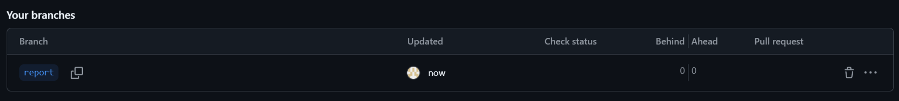

# Лабораторная работа №6

## 1.Цель работы
Изучение базовых возможностей системы управления версиями, опыт работы с Git Api, опыт работы с локальным и удаленным репозиторием. 

## 2.Ход работы
### Настройка клиента git
Для начала был настроен клиент git (Имя пользователя и email).


### Клонирование личного репозитория на свой компьютер
В заранее созданную папку клонируем репозиторий.


### Добавление нового файла
При помощи интерфейса GitHub создаем новый файл(add file --> create new file) new_file.


### Подтягивание изменений
Подтягиваем изменения в локальный репозиторий.


### Получение истории операций для веток
Получим историю операций для каждой из веток(master, branch1).


### Просмотр последних изменений
Просмотрим последние изменения для каждой из веток(branch1, master).


### Слияние веток
Выполним слияние в ветку master. Изначально это сделать не получится, так как необходимо разрешить конфликт при слиянии. Разрешим конфликт в текстовом редакторе.


### Удаление побочной ветки
После успешного слияния удалим побочную ветку branch1.


### Изменения в файле
Сделаем неесколько изменений в созданном нами файле. Для каждого изменения сделаем коммит.


### Откат коммита
Сделаем откат последнего коммита.


### Создание новой ветки
При помощи интерфейса GitHub создадим новую ветку(report) для будущего отчёта.



## 3.Лог команд
```
git config --global user.name "4319 Хмель Елизавета Алексеевна"
git config --global user.email "liza.xmel@mail.ru"
git config --global --list
git clone https://github.com/lizakhmel/LR6
git pull origin branch_name
git log --oneline
git checkout branch_name
git show
git merge branch_name
git status
git add
git commit -m "text"
git push origin --delete branch_name
git reset --hard 64a8e57
```
